# 4. Complete System Architecture

## 4.1 Critique of the originally proposed layer diagram

The prompt's proposed flow:

```text
Source Ingestion / Runtime Ingestion → Repository Model / Telemetry Model → Software Graph
   → Impact Analysis / Simulation Engine → Evidence Layer → AI Reasoning → Product UI
```

This is directionally right but has one structural problem worth calling out explicitly (this is the kind of critique a staff engineer is expected to make, not just accept):

**Evidence should not be a downstream layer that comes *after* Impact Analysis and Simulation — it must be a cross-cutting layer that both of those consume *and* produce.** Impact Analysis doesn't just generate evidence at the end; it *is* a graph traversal that *is itself* evidence (the traversal path is the evidence). Placing Evidence strictly after Impact/Simulation in the pipe implies evidence is a report generated afterward, when actually the Evidence Layer should be the same store that indexes graph edges' provenance from the moment the graph is built, and Impact/Simulation *query* it while producing their output.

Revised layering below reflects this: Evidence is a horizontal store, not a vertical stage.

## 4.2 High-level architecture (corrected)

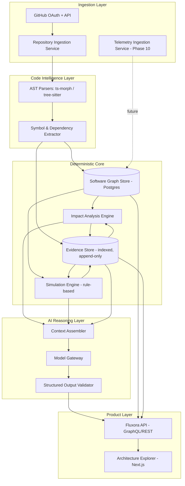

## 4.3 Container/component architecture

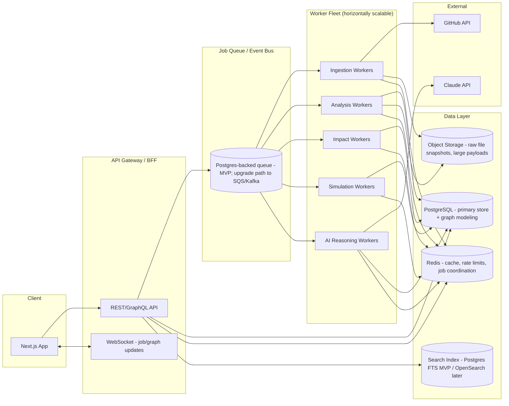

## 4.4 Repository ingestion flow

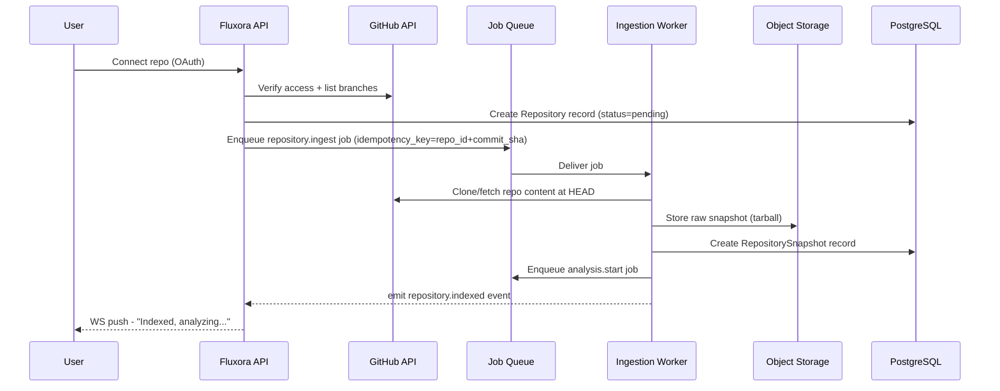

## 4.5 Code-analysis pipeline

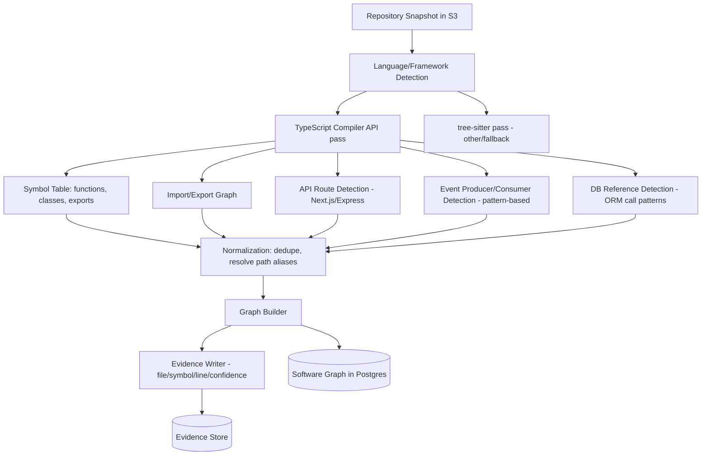

## 4.6 PR impact-analysis flow

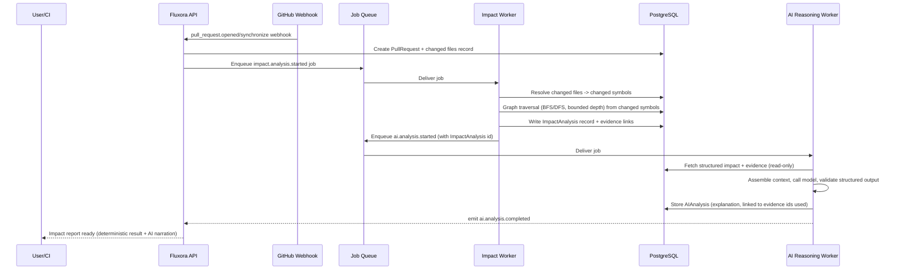

## 4.7 Simulation architecture

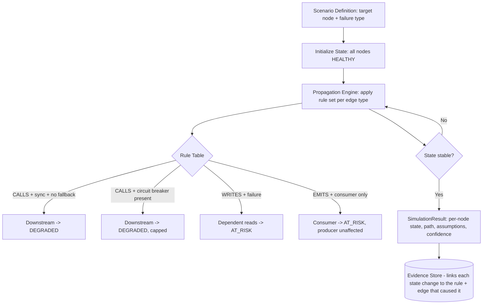

## 4.8 AI architecture (high level)

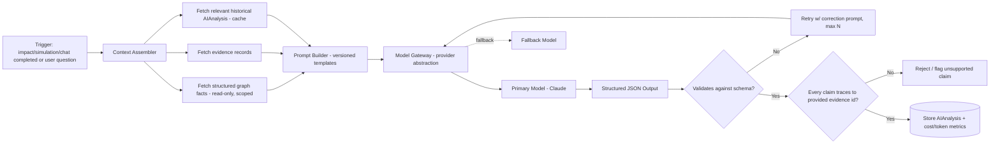

## 4.9 Event-driven architecture

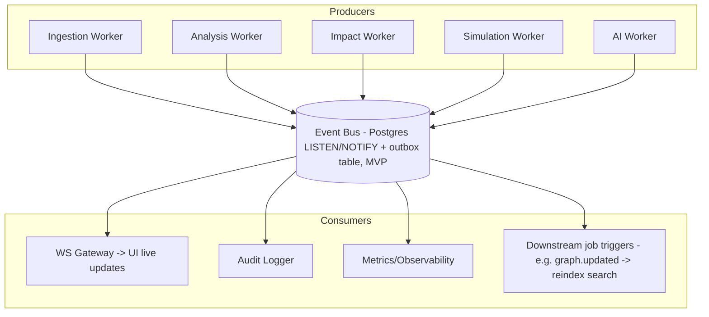

## 4.10 Database/data architecture

See `06-database-schema.md` for full entity design. Summary of engine placement:

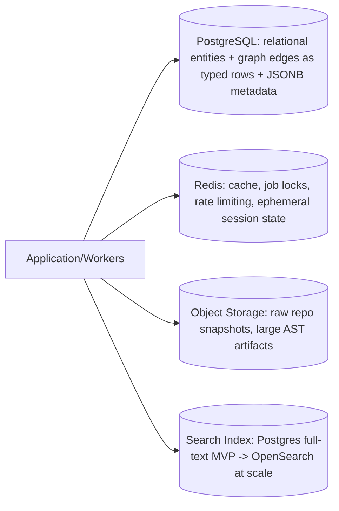

## 4.11 Authentication/security architecture

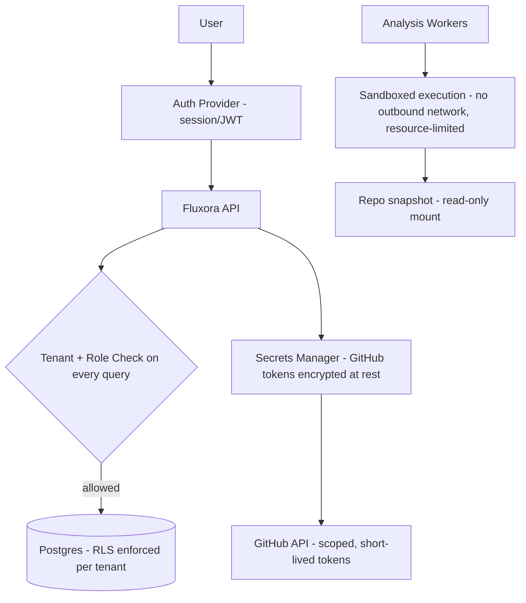

## 4.12 Deployment architecture

See `13-deployment-architecture.md` for full detail; summary:

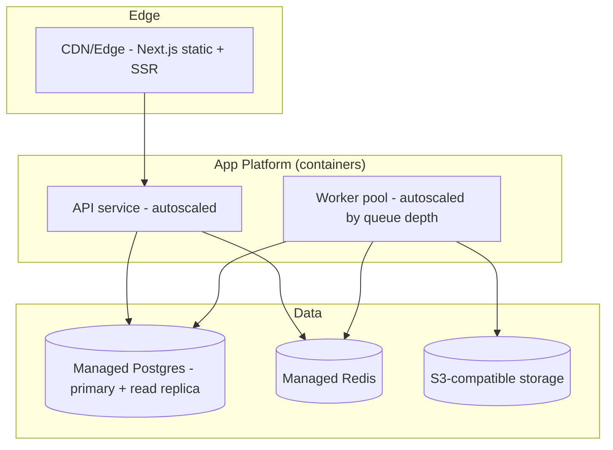

## 4.13 Observability architecture

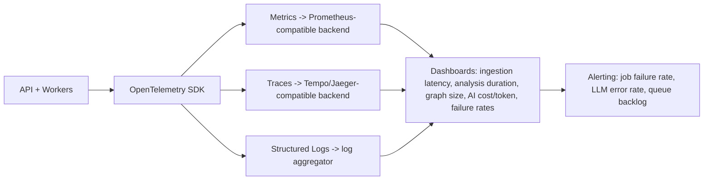
