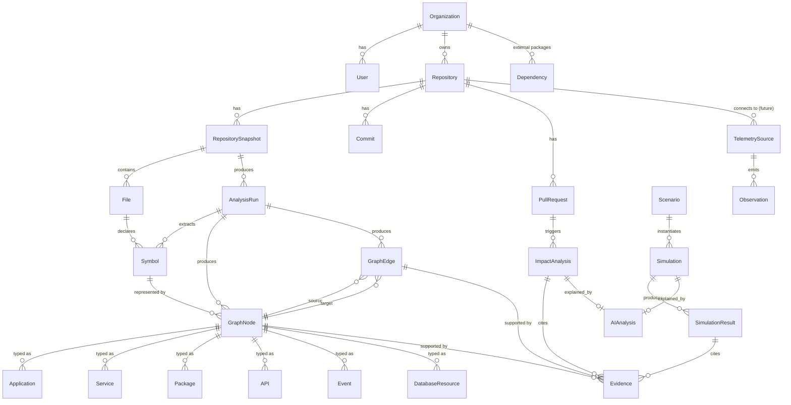

# 6. Database Schema

## 6.1 Storage-engine placement decision

**Decision: PostgreSQL for everything in the MVP, including the graph.** Not Neo4j/dedicated graph DB on day one.

### Why Postgres is sufficient for MVP graph modeling

- Software dependency graphs for a single repo (even a large one) are typically 1k–50k nodes and 5k–200k edges — well within what Postgres handles comfortably with proper indexing.
- Impact analysis traversals are **bounded-depth** (default 5 hops, see `05-component-responsibilities.md §5.9`), not unbounded shortest-path/community-detection queries where a native graph engine's traversal algorithms would meaningfully outperform recursive CTEs.
- Recursive CTEs (`WITH RECURSIVE`) handle bounded-depth traversal well when edges are properly indexed (`(source_id, edge_type)` and `(target_id, edge_type)` composite indexes).
- Keeping one storage engine drastically simplifies transactional consistency between graph writes and evidence writes (Principle P4/P7) — a cross-database transaction between Postgres and Neo4j is a real distributed-transactions problem you don't want in MVP.
- Team/solo-dev velocity: one query language, one backup/restore story, one place to reason about tenant isolation (Row-Level Security).

### Concrete triggers for introducing a dedicated graph database

Move to a dedicated graph engine (Neo4j, Memgraph, or a managed graph DB) when **any** of these become true:
1. Cross-repository / cross-organization graph federation is needed (queries spanning millions of edges across many tenants simultaneously).
2. Simulation/impact queries require unbounded shortest-path, centrality, or community-detection algorithms as a core product feature (not just bounded BFS).
3. p95 traversal latency on Postgres recursive CTEs exceeds target (e.g., >500ms) after indexing and query optimization have been exhausted, at realistic production graph sizes (100k+ nodes for a single tenant view).
4. Historical/time-travel graph queries (Phase 9+) require efficient temporal graph traversal that Postgres modeling makes awkward.

At that point, Postgres remains the system of record for entities/evidence/tenancy; the graph engine becomes a derived, rebuildable read-optimized projection — not a second source of truth.

### Engine placement summary

| Data | Engine | Why |
|---|---|---|
| Tenancy, users, repos, PRs, commits, jobs, evidence, impact/simulation results | PostgreSQL | Transactional, relational, needs joins with tenancy/RLS |
| Graph nodes/edges | PostgreSQL (adjacency-list tables + recursive CTE) | See above; MVP scale fits comfortably |
| Full-text/semantic search over symbols, files, evidence | Postgres full-text search (MVP) → OpenSearch/pgvector for semantic search (later) | MVP scale doesn't need a separate search cluster |
| Session/job-lock/rate-limit state | Redis | Ephemeral, high-churn, doesn't need durability guarantees of Postgres |
| Raw repository snapshots, large AST artifacts | S3-compatible object storage | Large binary/blob data, not queried relationally |
| AI response cache (identical context → identical explanation) | Redis (short TTL) + Postgres (durable `AIAnalysis` record) | Cost control without losing the durable audit trail |

## 6.2 Entity-relationship diagram

## 6.3 Entity definitions

### Organization
`id, name, github_org_id, plan_tier, created_at`
Tenant boundary. Every other table (directly or transitively via `organization_id`) is scoped to this. Enforced via Postgres Row-Level Security, not just application-layer `WHERE` clauses.

### User
`id, organization_id, email, github_user_id, role (owner/admin/member/viewer), created_at`

### Repository
`id, organization_id, github_repo_id, name, default_branch, connection_status (pending/active/needs_reauth/error), last_indexed_at, created_at`

### RepositorySnapshot
`id, repository_id, commit_sha, ref, storage_uri (S3 path), file_count, size_bytes, created_at`
Immutable. A new snapshot per analyzed commit/ref, not overwritten.

### Commit
`id, repository_id, sha, author, message, committed_at, parent_shas (array)`

### PullRequest
`id, repository_id, github_pr_number, title, base_sha, head_sha, status (open/merged/closed), changed_files (JSONB: [{path, additions, deletions, patch_summary}]), created_at`

### File
`id, snapshot_id, path, language, size_bytes, sha256`

### AnalysisRun
`id, snapshot_id, status (pending/running/completed/partial/failed), parser_versions (JSONB), started_at, completed_at, coverage_summary (JSONB: files_parsed, files_skipped, skip_reasons)`
Versioned — each run is immutable once completed; the graph is queried "as of" a given `AnalysisRun`.

### Symbol
`id, analysis_run_id, file_id, kind (function/class/interface/variable/component), name, exported (bool), line_start, line_end`

### Application / Service / Package (all share a shape, distinguished by `node_type`)
Modeled as **typed `GraphNode` rows** (see 6.4 rationale) rather than separate tables, to keep the graph traversal logic uniform across node types.

### API
Represented as a `GraphNode` with `node_type='api'` and `metadata JSONB` containing `{method, route_pattern, framework}`.

### Event
`GraphNode` with `node_type='event'`, `metadata: {event_name, transport (kafka/sqs/in-process/etc, where detectable)}`.

### DatabaseResource
`GraphNode` with `node_type='database'`, `metadata: {engine_guess, table_names_if_detectable}`.

### Dependency
`id, organization_id, repository_id, package_name, version, ecosystem (npm), is_dev_dependency` — external package dependencies, distinct from internal `GraphNode`/`GraphEdge` relationships.

### GraphNode
`id, analysis_run_id, node_type (application/service/package/module/symbol/api/event/database), name, path, metadata (JSONB), confidence (0.0–1.0)`

### GraphEdge
`id, analysis_run_id, source_node_id, target_node_id, edge_type (IMPORTS/CALLS/EXTENDS/EXPOSES_ROUTE/EMITS_EVENT/CONSUMES_EVENT/QUERIES_DB/WRITES), confidence, provenance (static-analysis/inferred/ai-hypothesis/runtime-observed)`
Indexes: `(source_node_id, edge_type)`, `(target_node_id, edge_type)`, `(analysis_run_id)`.

### Evidence
`id, subject_type (graph_edge/graph_node/impact_finding/simulation_state), subject_id, file_path, symbol_id (nullable), line_start, line_end, relationship_description, analysis_run_id, confidence, created_at`
Append-only. Never updated in place — a re-analysis produces new Evidence rows tied to the new `AnalysisRun`.

### ImpactAnalysis
`id, pull_request_id, analysis_run_id (graph version used), status, direct_impact (JSONB node list), downstream_impact (JSONB node list w/ hop distance), affected_apis (JSONB), affected_events (JSONB), workflow_impact_summary (JSONB), truncated (bool), created_at`

### Scenario
`id, organization_id, repository_id, name, target_node_id, failure_type (unavailable/latency/capacity/removal), parameters (JSONB), created_by, created_at`

### Simulation
`id, scenario_id, analysis_run_id, status, created_at`

### SimulationResult
`id, simulation_id, node_id, resulting_state (healthy/degraded/at_risk/failed), propagation_path (JSONB), rule_applied, assumptions (JSONB), confidence`

### AIAnalysis
`id, subject_type (impact_analysis/simulation/chat_query), subject_id, model_used, prompt_version, input_evidence_ids (array), output_text, output_structured (JSONB), validation_status (passed/rejected/fallback), token_count, cost_usd, latency_ms, created_at`

### TelemetrySource (future)
`id, repository_id, provider (datadog/otel/newrelic), connection_config (encrypted), status`

### Observation (future)
`id, telemetry_source_id, node_id (linked graph node), metric_name, value, observed_at`

## 6.4 Design rationale: typed nodes vs. per-type tables

**Decision:** `Application`, `Service`, `Package`, `Module`, `API`, `Event`, `DatabaseResource` are all rows in one `GraphNode` table, distinguished by `node_type` + `metadata JSONB`, rather than seven separate tables with seven separate FK relationships into `GraphEdge`.

**Why:** Graph traversal (impact analysis, simulation) needs to walk edges *uniformly* regardless of what kind of thing is on either end — "what does this API depend on" and "what does this Service depend on" are the same query shape. Separate tables would mean either seven-way UNION queries on every traversal, or seven separate `source_type`/`target_type` discriminator columns on `GraphEdge` — both worse than one polymorphic node table with an index on `node_type`. The trade-off (losing some type-specific column constraints, relying on `metadata` JSONB) is worth it for traversal simplicity, and JSONB with Postgres's GIN indexing keeps metadata queries fast enough at MVP scale.

## 6.5 Multi-tenancy enforcement

- Every top-level table carries `organization_id`.
- Postgres Row-Level Security policies enforce `organization_id = current_setting('app.current_org_id')` on every table, set per-connection at the start of each request — defense in depth beneath the application-layer authz check in `05-component-responsibilities.md §5.14`.
- Child tables (e.g., `GraphNode`, `Evidence`) inherit tenancy through their parent (`analysis_run_id → snapshot_id → repository_id → organization_id`), enforced via RLS policies that join up the chain, not by duplicating `organization_id` on every table (denormalizing it onto hot-path tables like `GraphNode`/`GraphEdge`/`Evidence` is a reasonable later optimization once query plans show the join cost matters).
