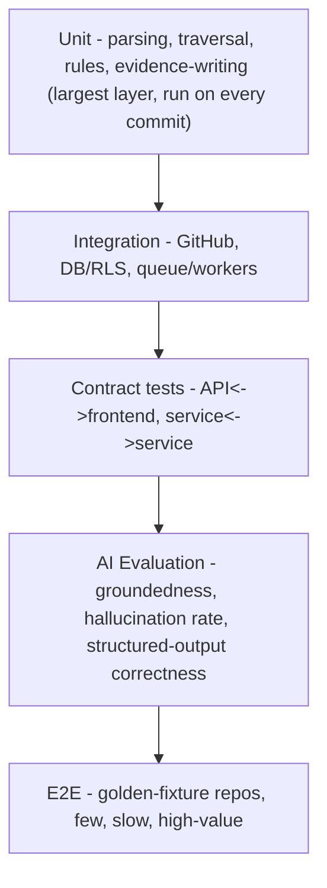

# 12. Testing Strategy

## 12.1 Unit tests

**AST parsing / symbol extraction**
- Fixture-based: a curated set of TS/JS/TSX files exercising known-hard cases (barrel-file re-exports, path aliases, dynamic `import()`, decorators, JSX component composition, monorepo workspace references) with hand-verified expected symbol/edge output.
- Regression fixtures added every time a real-world repo reveals a misparse — this fixture library is a long-term asset, not a one-time test pass.

**Graph traversal (impact analysis)**
- Synthetic graphs (constructed in-memory, not requiring a real repo) covering: linear chains, fan-out, fan-in, cycles, disconnected components, depth-limit truncation boundary conditions (exactly at limit, one over).
- Property-based tests: traversal must always terminate on a graph with cycles; traversal must never return a node not reachable within `max_depth`.

**Policy/rules (simulation engine)**
- Each rule in the propagation rule table tested in isolation (given this edge type + these node states + this metadata, assert the exact resulting state + confidence).
- Full-scenario tests against small hand-built graphs with known expected propagation outcomes (the exact "Payment provider unavailable" example from the diagrams doc, asserted end-to-end).

**Evidence writer**
- Every graph-write path asserted to produce a corresponding evidence row; a lint-style test scans code paths that create `GraphEdge`/`ImpactAnalysis`/`SimulationResult` rows and fails CI if a new write path is added without a corresponding evidence write (enforces Principle P2 structurally, not just by convention).

## 12.2 Integration tests

- **GitHub ingestion:** against a recorded fixture repository (VCR-style HTTP recording of GitHub API responses) — real network calls only in a small, separately-run nightly suite against a real test GitHub org, to keep the main suite fast and deterministic.
- **Database:** migrations tested up/down against a real Postgres instance (via testcontainers or equivalent) in CI; RLS policies specifically tested by attempting cross-tenant reads and asserting they return empty, not just "no error."
- **Queue/workers:** job enqueue → worker pickup → completion tested against a real (test-instance) Postgres-backed queue, including the idempotency-key dedup path (enqueue the same job twice, assert single execution) and the crash-recovery path (kill a worker mid-job, assert the job becomes reclaimable and re-execution doesn't duplicate graph writes).

## 12.3 Contract tests

- Internal service boundaries (API ↔ workers via job payloads, workers ↔ AI gateway) have schema contracts (JSON Schema or equivalent) checked in CI on both producer and consumer sides, so a payload-shape change in one place fails CI before it breaks the other side at runtime.
- Frontend ↔ API contract enforced via generated TypeScript types from the API's OpenAPI/schema definition — the frontend cannot silently drift from the API shape.

## 12.4 End-to-end tests

Primary E2E path, run against a real (test) GitHub repo in a staging environment:

```
Connect repo → wait for analysis.completed → assert graph node/edge counts within expected range
  → open a known PR fixture → analyze impact → assert direct/downstream impact matches hand-verified expectation
  → run "target service unavailable" simulation → assert propagation matches expected states
  → assert AI explanation is generated and its evidence_ids are a subset of the impact analysis's evidence
```

A small, stable set (3–5) of real-world open-source TypeScript/Next.js repositories are maintained as "golden fixtures" with hand-verified expected graph shape and impact-analysis output for known PRs — this is the single highest-value testing asset for this product, since it validates the entire deterministic core against ground truth a human actually checked.

## 12.5 AI evaluation

Treated as a distinct, continuously-run test suite — not a manual spot-check.

**Groundedness / factual consistency**
- For each `AIAnalysis` produced against a golden-fixture impact/simulation result, assert every cited `evidence_id` is (a) present in the manifest that was sent as context, and (b) actually supports the claim it's attached to (this second check uses a held-out evaluator prompt or human-labeled test set, since it's a semantic check the schema validator alone can't fully make).

**Evidence usage**
- Assert the model's summary does not introduce named entities (service names, file names) that don't appear anywhere in the provided evidence — a simple but effective hallucination tripwire.

**Structured output correctness**
- 100% of test-suite AI calls must produce schema-valid JSON on first attempt or the first retry; a regression here (rising retry rate) is a release blocker, tracked as a metric over time, not just pass/fail.

**Hallucination rate**
- Tracked as a percentage across the golden-fixture eval set (claims failing the groundedness check / total claims), with a target ceiling (e.g., <2%) gating prompt-version promotion.

**Latency & cost**
- Every eval run records p50/p95 latency and cost per call type, tracked over time alongside quality metrics — a prompt change that improves groundedness but doubles cost/latency is a real trade-off decision, not a free win, and the eval suite should make that trade-off visible.

## 12.6 Test pyramid summary


