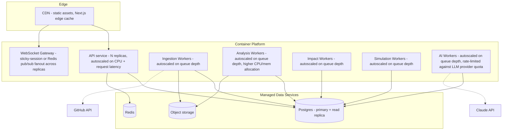

# 13. Deployment Architecture

## 13.1 Environment strategy

| Environment | Purpose | Data |
|---|---|---|
| Local | Individual development | Dockerized Postgres/Redis, mocked/recorded GitHub + LLM calls |
| Preview (per-PR) | Ephemeral environment per pull request | Seeded synthetic data + one golden-fixture repo |
| Staging | Pre-prod validation, E2E suite runs here | Golden-fixture repos, non-production LLM key with budget caps |
| Production | Real customer data | Full isolation, production secrets, monitoring/alerting live |

## 13.2 Compute platform

**Decision: containerized services on a managed container platform** (e.g., AWS ECS Fargate / Google Cloud Run / Render / Fly.io — the specific provider is a cost/familiarity decision, not an architectural one) rather than raw VMs or a full Kubernetes cluster for MVP.

**Why not Kubernetes for MVP:** the operational overhead of running and securing a Kubernetes control plane is not justified until the service count and scaling sophistication genuinely need it (custom autoscaling policies beyond CPU/queue-depth, multi-region active-active, complex service mesh requirements). A managed container platform gives horizontal autoscaling, zero-downtime deploys, and health-check-based recovery without that overhead. Revisit if/when the team or the scaling requirements outgrow it (see `15-scaling-strategy.md`).

## 13.3 Service topology



Analysis Workers are deployed as a **separate pool from the API service and other workers**, sized with more CPU/memory per instance, because AST parsing is the most resource-intensive step in the pipeline — isolating it prevents a large-repo analysis spike from starving API request latency or lighter-weight job types.

## 13.4 CI/CD pipeline

```
PR opened
  → lint + typecheck
  → unit tests (parallelized by package)
  → integration tests (testcontainers Postgres/Redis)
  → contract tests
  → build container images
  → deploy preview environment
  → E2E suite against preview (golden-fixture repos)
  → AI eval suite against preview (budget-capped LLM key)
  → manual review + approval
merge to main
  → rebuild + deploy to staging
  → full E2E + AI eval suite against staging
  → manual promotion to production (or automatic for low-risk changes, e.g. frontend-only)
  → deploy production (rolling/blue-green)
  → post-deploy smoke tests
  → automatic rollback on smoke-test failure or elevated error rate (first N minutes post-deploy)
```

## 13.5 Database migrations

- Forward-only, additive-first migrations (add nullable column → backfill → make required in a later migration) to avoid deploy-time locking issues on large tables as data grows.
- Migrations run as a separate CI/CD step before new application code is deployed, with the constraint that application code must remain compatible with both the pre- and post-migration schema during the rollout window (classic expand/contract pattern).

## 13.6 Secrets & configuration

- Per-environment secrets injected at deploy time from the secrets manager (`11-security-architecture.md §11.3`), never baked into container images.
- Configuration (feature flags, rule-table versions, prompt versions) is code-deployed, not runtime-mutable in production without going through the same CI/CD review path — this is a deliberate choice to keep the deterministic core's behavior fully reproducible from a given commit SHA.

## 13.7 Release strategy

- **Frontend/API:** rolling deploys with health-check gating.
- **Workers:** deployed independently from the API (different release cadence is fine since they communicate only via the job queue and database, not direct calls) — allows, e.g., shipping an AST-parser fix without redeploying the whole API.
- **Rule table / prompt version changes:** treated as their own release artifact with their own eval-gate (12.5), since a bad rule-table change or prompt regression is a correctness bug in the product's core value proposition, not a routine code change.
